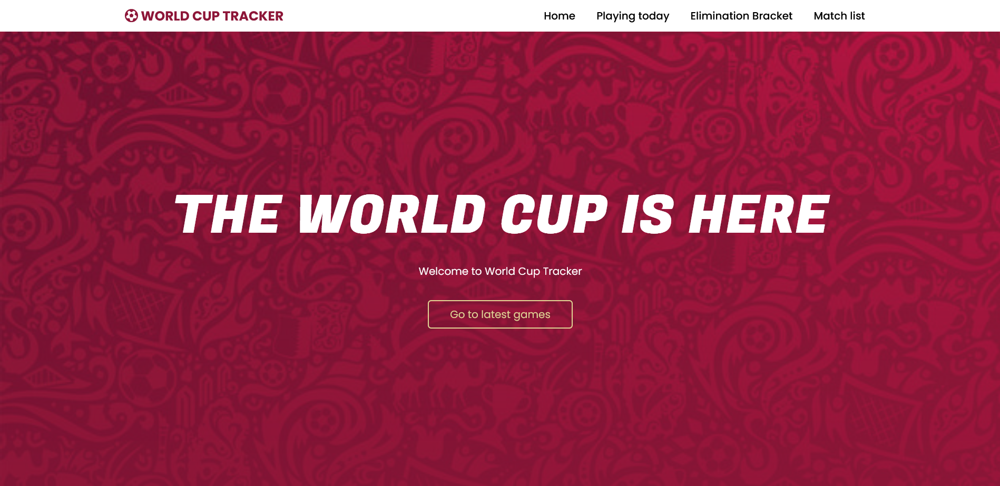

# Prueba final React I: World Cup Tracker

---

## 

## Links

---

- [Preview del sitio](https://worldcuptracker.netlify.app)
- [Link al video explicatorio](https://worldcuptracker.netlify.app)

## API Utilizada

---

Para crear el sitio decidí usar la api [World Cup JSON](https://worldcupjson.net/), API que registra los resultados y otros detalles del mundial FIFA Qatar 2022.

## Características

---

El sitio cuenta con un diseño responsivo, con tres secciones informativas:

### Playing Today

La sección "Playing Today" muestra los partidos que se encuentran agendados para el día de hoy, accediento desde el endpoint de partidos diarios de la API. En el caso de no haber partidos, se mostrará un mensaje indicando que no existen partidos disponibles.

### Elimination Bracket

Muestra el estado actual de la fase eliminatoria del mundial. Las card muestran los estados de cada partido, los países en competencia, y los resultados de cada partido

### Match List

Esta sección contiene la información de todos los partidos del mundial, en un formato sorteable y filtrable.  
La lista cuenta con un buscador, en el que se puede buscar por país. También cuenta con un filtro por ronda del mundial, y un sorteador que muestra los resultados desde el primer al último partido, o viceversa.
